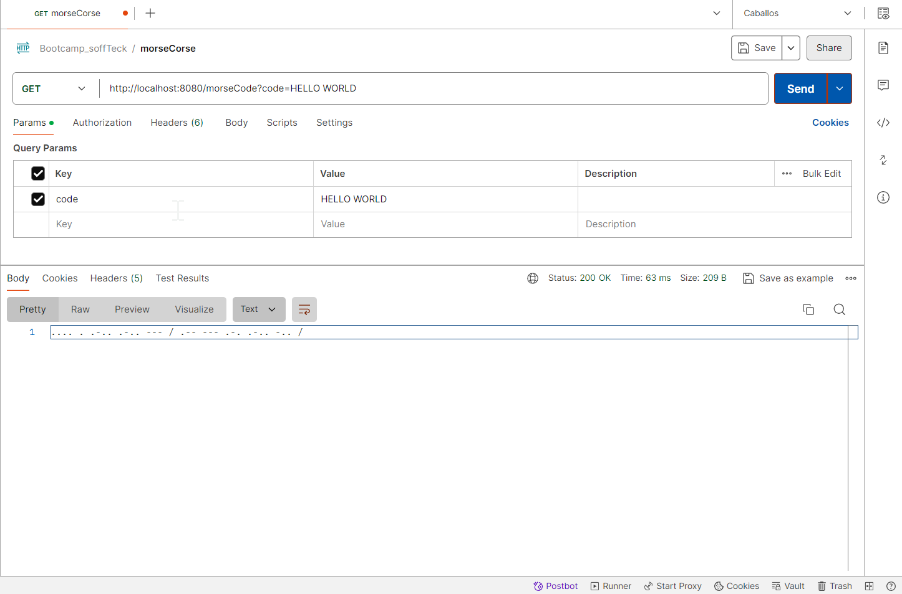

# Conversión de Texto a Código Morse

Este proyecto proporciona una mejora significativa en la conversión de texto a código Morse. Ahora, no sólo se pueden convertir palabras individuales, sino que también se pueden convertir oraciones completas.

## Funcionalidad

La funcionalidad principal de este proyecto es convertir una cadena de texto en su equivalente en código Morse. Cada letra del alfabeto y cada número del 0 al 9 tienen una representación única en código Morse, que se ha mapeado en este proyecto.

Para convertir una oración completa, la cadena de texto se divide en palabras individuales. Cada palabra se convierte en código Morse letra por letra. Después de cada palabra convertida, se añade un separador de palabras ("/") para indicar el final de una palabra y el comienzo de la siguiente.

## Uso

Para utilizar esta funcionalidad, simplemente se debe hacer una petición GET a la API en la ruta `/morseCode` con el parámetro `code` que contiene la cadena de texto que se desea convertir. La API devolverá la cadena de texto convertida en código Morse.

## Ejemplo

Supongamos que queremos convertir la frase "HELLO WORLD". La petición a la API sería:

>.... . .-.. .-.. --- / .-- --- .-. .-.. -..

Este proyecto proporciona una forma sencilla y eficaz de convertir texto en código Morse, permitiendo la conversión de oraciones completas y no sólo de palabras individuales.

